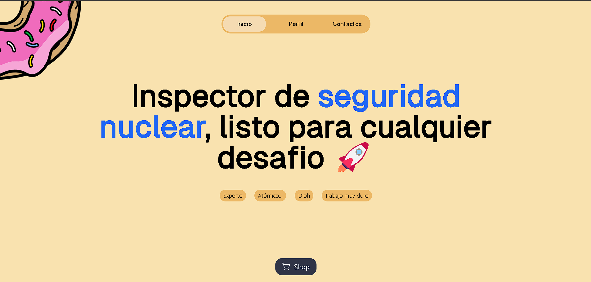

    
    <h1 align="center">D'oh Studio</h1>

    
    

> [!IMPORTANT]
> El proyecto está en desarrollo, por lo que aún no está terminado.

<table>
    <tr>
        <td>
            
        </td>
        <td>
            
        </td>
    </tr>
</table>

`D'oh studio` es un proyecto de práctico Front-end, donde se recrea
la página [oh.studio](https://oh.studio/) pero con un toque de Homero Simpson.

## 🎯 Características

- **AstroJS**: Utiliza AstroJS como generador de sitios web.
- **TailwindCSS**: Utiliza TailwindCSS como framework de estilos.
- **Astro collections**: Utiliza Astro collections para la creación de proyectos.
- **GitHub Actions**: Utiliza GitHub Actions para la generación de la página.